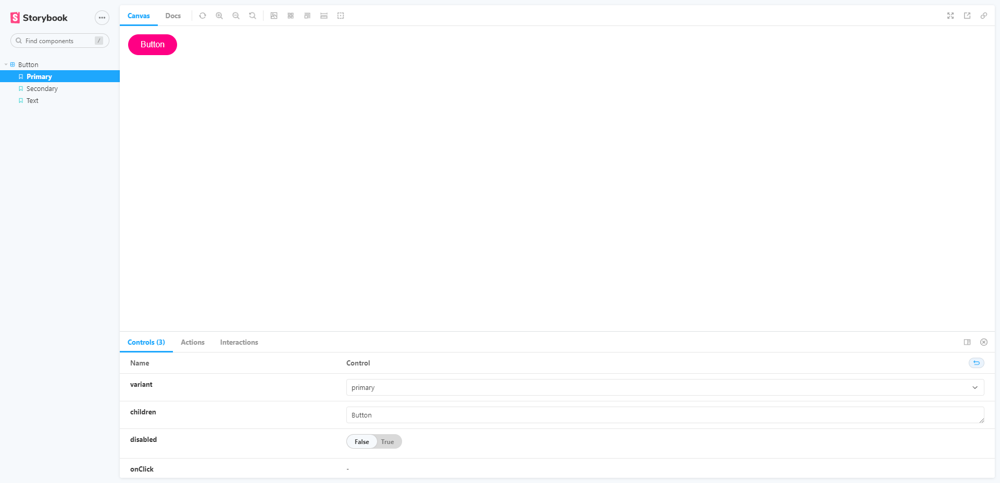

## React project with Webpack

  

A react project built from scratch with webpack

## Technologies

- Webpack
- Babel
- ESlint
- Stylelint
- SASS
- Jest
- React Testing Library
- Storybook
- React
- TypeScript
- Husky
- Commitilint
- Commitzen
- Semantic Release
